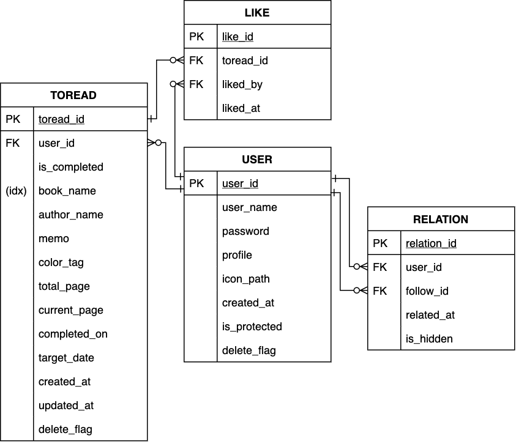

# suodu-a-to-read-list-app
讀書管理網站「所讀」（正在努力開發中）

### 版本
- Release version 1.0 (2020-06-16)

### How to get started
```
git clone https://github.com/kawabata2018/suodu-a-to-read-list-app.git
cd docker-lamp
make init
```

### 變量命名規則
| 語言 | 類型 | 命名法 |
|---|---|---|
| html | name属性 | lowerCamelCase |
| html | id属性 | lowerCamelCase |
| php | 局部變量 | lowerCamelCase |
| php | 類 | UpperCamelCase |
| php | 函數 | lowerCamelCase |
| php | session參數 | lower_snake_case |
| javascript | 變量 | lowerCamelCase |
| sql | 變量 | lower_snake_case |

- 用戶未登錄時使用 `$_SESSION['id']`
- 已登錄時使用 `$_SESSION['user_id']`

### 數據庫設計


### 備忘錄
- 關於 `int(M)` 的問題
> M表示最大顯示寬度。顯示寬度與所佔多少存儲空間無任何關係  
> int(3), int(4), int(8)在磁盤上都是佔用4bytes的存儲空間 

- 關於 `stmt->execute(array)` 與boolean型的問題
> https://www.php.net/manual/en/pdostatement.execute.php  
> All values are treated as PDO::PARAM_STR.  

- 關於 `httpd.conf`
> https://qiita.com/non0311/items/1114f080603d9007b1c4  
> https://qiita.com/dokkoisho/items/03746e58d975bd7a35ec  
