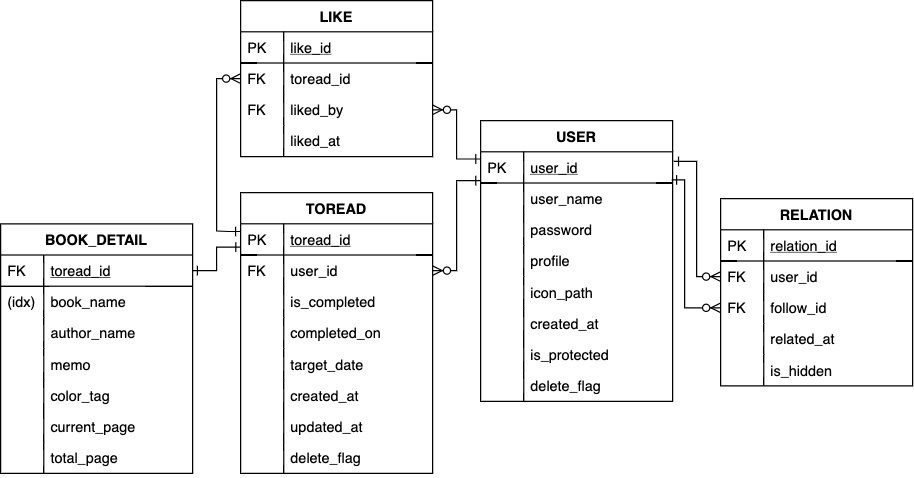

# suodu-a-to-read-list-app
讀書管理網站「所讀」（正在努力開發中）

### How to start
```
git clone https://github.com/kawabata2018/suodu-a-to-read-list-app.git
cd docker-lamp
make init
```

### 變量命名規則
| 語言 | 類型 | 命名法 |
|---|---|---|
| php | 局部變量 | lowerCamelCase |
| php | 類 | UpperCamelCase |
| php | 函數 | lowerCamelCase |
| php | session等中參數 | lower_snake_case |
| sql | 變量 | lower_snake_case |

- 用戶未登錄時使用 `$_SESSION['id']`
- 已登錄時使用 `$_SESSION['user_id']`

### 數據庫設計

